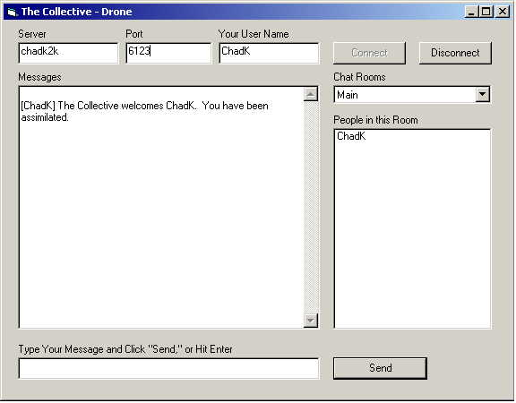



## The Collective Chat App

### Description

This is a chat server and client application with chatrooms for use on an intranet. It uses both the Winsock control and the Winsock API for socket communication.
 
### More Info
 
You must have the server running, and each client must know the server name and port to connect to. You could put default values in the appropriate text controls if you want...

             |
---                |---
**Submitted On**   |2000-05-01 11:48:36
**By**             |[N/A](https://github.com/Planet-Source-Code/PSCIndex/blob/master/ByAuthor/empty.md)
**Level**          |Intermediate
**User Rating**    |5.0 (10 globes from 2 users)
**Compatibility**  |VB 5\.0, VB 6\.0
**Category**       |[Complete Applications](https://github.com/Planet-Source-Code/PSCIndex/blob/master/ByCategory/complete-applications__1-27.md)
**World**          |[Visual Basic](https://github.com/Planet-Source-Code/PSCIndex/blob/master/ByWorld/visual-basic.md)
**Archive File**   |[CODE\_UPLOAD5392512000\.zip](https://github.com/Planet-Source-Code/the-collective-chat-app__1-7639/archive/master.zip)

